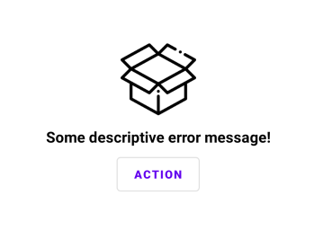

# MaterialErrorView
UI Component. Simple horizontal divider with title for android.

## Sample

  
 
 

## Implementation
**Step 1:** Add to project level build.gradle

    allprojects {
		repositories {
			...
			maven { url 'https://jitpack.io' }
		}
	}

**Step 2:** Add to app level build.gradle

	dependencies {
	    implementation 'com.github.u-barnwal:MaterialErrorView:VERSION'
	}
## How to use
**Create view**

    <com.isolpro.library.materialerrorview.MaterialErrorView
      android:id="@+id/mev"
      android:layout_width="wrap_content"
      android:layout_height="wrap_content"
      android:layout_centerInParent="true"
      app:eb_action="Action"
      app:eb_icon="@drawable/img_empty"
      app:eb_show_icon="true"
      app:eb_message="Some descriptive error message!" />

**Setting action**

    MaterialErrorView mev = findViewById(R.id.mev);

    mev.setActionCallback(o -> {
      Toast.makeText(this, "Performing the action!", Toast.LENGTH_SHORT).show()
    });

## Features

 - Fully adaptive
 - Lightweight

## Links
 - Live example
   - https://pricelistlite.isolpro.in
    - https://transactionslistlite.isolpro.in
